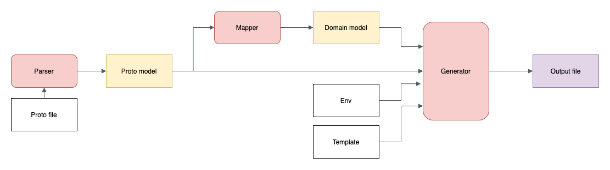

Tao is a protocol and interface first micro-service approach.

This project is in very early development stage, things may changes frequently.

## The Tao approach
The Tao approach includes

 * A command tool ```tao```
 * A simple ioc container for service locate
 * Several support packages ```e.coding.net/miraclew/tao/pkg```

This project is inspired by a [Youtube presentation](https://www.youtube.com/watch?v=j6ow-UemzBc)
 
### The ```tao``` command
```tao``` command is the core tool to generate code/documents/sql etc.

Execute ```go get -u e.coding.net/miraclew/tao/cmd/tao``` to install ```tao``` command

sub-commands

 * ```tao proto``` generate a skeleton .proto [Google ProtoBuffer](https://developers.google.com/protocol-buffers) syntax file
 * ```tao api``` generate api/event/client go code
 * ```tao svc``` generate service implementation go code, include service, handler etc.
 * ```tao sql``` generate SQL schema of model message in .proto file
 * ```tao doc``` generate OpenAPI v3 files
 * ```tao dart``` generate dart client code
 * ```tao android``` generate android client sdk. TODO
 * ```tao ios``` generate iOS client sdk. TODO

### How ```tao``` generators works


 
### locator: the ioc container
We introduce a locator package as the IOC container.
 * Services register to the locator 
 * Service obtain it's dependency services from locator 
 
## Steps to build a micro-service
 * Write a service proto file
 * Generate api/event/client code
 * Implement service

### Write service proto file

A service include 2 parts, an api interface and an event interface,
let's say we want build a question service.


```
mkdir question
cd question
touch question.proto 
```

here's an example of question.proto file.
```proto
syntax = "proto3";

package question.v1;

option (resource) = "Question";

enum QuestionType {
    Text = 0;
    Audio = 1;
}

// Resource
message Question {
    option (model) = true;
    int64 Id = 1;
    int64 UserId = 2;
    int64 TopicId = 3;
    string Title = 4;
    string Content = 5;
    QuestionType Type  = 6;
    int64 Positives = 7;
    int64 Negatives = 8;
    int32 State = 9;
}

// Service (APIs in the service)
service Service {
    rpc Create(CreateRequest) returns (CreateResponse);
    rpc Delete(DeleteRequest) returns (DeleteResponse);
    rpc Update(UpdateRequest) returns (UpdateResponse);
    rpc Get(GetRequest) returns (GetResponse);
    rpc Query(QueryRequest) returns (QueryResponse);
}

message CreateRequest {
    string Title = 1;
    string Content = 2;
    QuestionType Type  = 3;
}

message CreateResponse {
    int64 Id = 1;
}

message DeleteRequest {
    int64 Id = 1;
}

message DeleteResponse {
    string result = 1;
}

message UpdateRequest {
    int64 Id = 1;
    map<string, Any> Attrs = 2;
}

message UpdateResponse {
    string Result = 1;
}

message GetRequest {
    int64 Id = 1;
    map<string, Any> Filter = 2;
}

message GetResponse {
    Question Result = 1;
}

message QueryRequest {
    int64 Offset = 1;
    int32 Limit = 2;
    map<string, Any> Filter = 3;
    string Sort = 4;
}

message QueryResponse {
    repeated Question Results = 1;
}

// Event (subscribe events from this service)
service Event {
    option (internal) = true;
    rpc HandleCreated(CreatedEvent) returns (Empty);
    rpc HandleDeleted(DeletedEvent) returns (Empty);
    rpc HandleUpdated(UpdatedEvent) returns (Empty);
}

message CreatedEvent {
    Question Data = 1;
}

message DeletedEvent {
    Question Data = 1;
}

message UpdatedEvent {
    int64 Id = 1;
    map<string, Any> Attrs = 2;
}
```

### Generate api/event/client code

```
tao api
```

## Demo project

[Demo Project](https://e.coding.net/miraclew/tao-demo)
 
## Services intercommunication

Let's say we have question, answer service:

### Answer service call api in Question service 
When we create a answer, the answer service should able to call question service to get the question.

An example of answer service code in ```answer/svc/service.go```
```go
func (s *DefaultService) Create(ctx context.Context, req *answer.CreateRequest) (*answer.CreateResponse, error) {
    # Call question service from answer service
    locator.Question().Get(ctx, &question.GetRequest{Id: req.QuestionID})
    
    # Validate request and persist into database
    blah blah ...

    # Publish AnswerCreated event
    locator.Publisher().Publish("Answer.Created", &answer.CreatedEvent{Data: &a})
}
```

### Question service handle events from Answer service
When an answer created, we want update answers counter of the question.

An example of question event handler code in ```question/svc/handler.event.go```
```go
func (h EventHandler) Register() {
	locator.AnswerEvent().HandleCreated(h.onAnswerCreated)
}

func (h EventHandler) onAnswerCreated(ctx context.Context, req *answer.CreatedEvent) error {
	_, err := h.Service.Update(ctx, &question.UpdateRequest{
		Id: req.Data.QuestionID,
		Attrs: map[string]interface{}{
			"Answers": "Answers+1",
		},
	})
	if err != nil {
		return errors.Wrap(err, "question event handler: update error")
	}
	return nil
}
```


## External communication with generated SDK

```tao``` command generates APP/H5 sdk from .proto file.

The sdk files can be used to interact with services.

 * Dart client for Flutter
 
## TODO
 * Android Java/Kotlin client (TODO)
 * iOS Swift client (TODO) 
 * Support JAVA project
