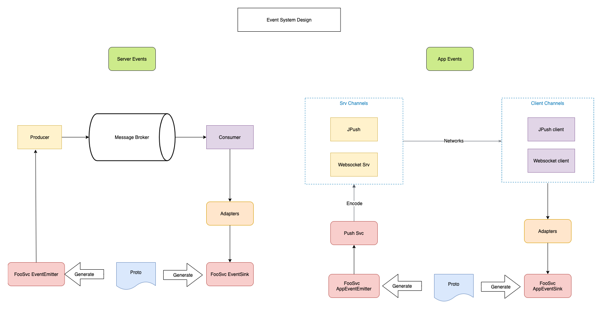

# Push in tao

## Ad-hoc subscription

一次性消息订阅使用场景: 用户使用APP是，进入某个特定页面后会自动订阅该页面的相关事件，离开后自动取消订阅。

例如: 用户进入问题详情/回答列表页面, 会自动订阅该问题相关事件，如新的回答，点赞等消息。

## User online subscription

用户在线就自动订阅的

## Offline notification